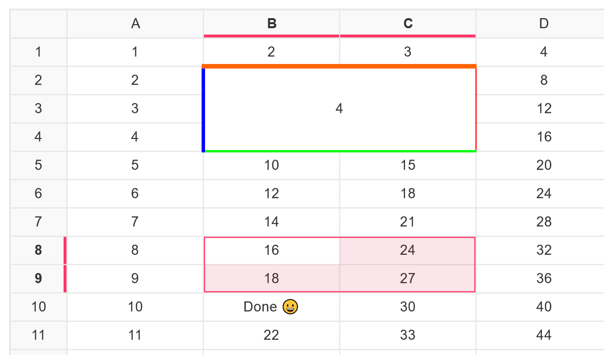

# Table Engine

    

> Library to visualize huge tables in web environments with high-performance rendering.

    

> Screenshot showing the demo application from https://bennyboer.github.io/table-engine/.
> Your implementation does not need to look like that, row/column headers are optional and need to be defined by yourself.

- You need to display huge tables on your web page?
- A normal HTML table element is just not good enough (laggy, not developer friendly)?
- You need to be able to select cells?
- You need a library that does not dictate what kind of table you want to display (Spreadsheet, data visualization with
  column headers, ...)?
- HELP! How to do fixed rows and columns?!

**Then this project might be just what you need!**

Table Engine gives you freedom to display **any** kind of table you can imagine. Want to build a spreadsheet component
or a high-performance data-visualization -> Why not?!
With the Table Engine there are no such concepts as column/row headers, sorting, filtering, ... - just **cells**, **
borders**, and one or multiple cell **selections**. Essentially Table Engine is more of a framework for building table
components so you as a developer have to build your own thing on a higher abstraction level.

This project is work in progress, but you might check out our [demo](#demo) to see a snapshot of the current state.

## Demo

You might want to take a look at the current example being constantly rebuilt during
development: https://bennyboer.github.io/table-engine/.

## Architecture

We aim to provide a high-performance table library that may display nearly infinite amounts of data without the user
really noticing. Normal HTML table elements get pretty laggy when getting large and are thus not always an option. This
library builds around HTML5 canvas to draw the table from scratch, thus achieving a smooth user experience.

## Getting started

First and foremost install NodeJS (Check one of the workflow files under `.github/workflows` for the current version we use).
Afterwards install yarn if you haven't already using `npm install -g yarn`.

Install dependencies using `yarn install --frozen-lockfile` in the root of the repository and also under `example` if you intend to run the example.

Build the library using `npm run build` or run tests with `npm run test`.

The example is an Angular application that you may start using `npm run start` in the `example` folder.
