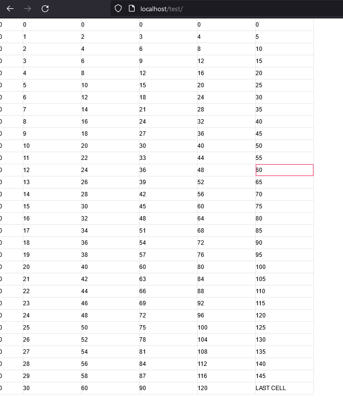

# JavaScript usage

If you're using a standard Node.js/webpack approach you will be able to just install the table engine using `npm install table-engine`.
Afterwards your `index.js` file might look like the following for a minimal example:

```js
import {TableEngine, CellModel, CellRange, TextCellRenderer} from "table-engine";

const tableContainer = document.getElementById("table-container");

const cellModel = CellModel.generate(
    [
        {
            range: CellRange.fromSingleRowColumn(30, 5),
            rendererName: TextCellRenderer.NAME,
            value: "LAST CELL"
        }
    ],
    (row, column) => row * column,
    (row, column) => TextCellRenderer.NAME,
    (row) => 25,
    (column) => column === 0 ? 50 : 120,
    new Set(),
    new Set()
);

const engine = new TableEngine(tableContainer, cellModel);

engine.registerCellRenderer(new TextCellRenderer());

engine.initialize();
```

When using webpack you can bundle the JavaScript app using simply `webpack` without further configuration (given your index.js file resides in a src folder).

And you're `index.html` file:

```html
<!DOCTYPE html>
<html>
    <head>
        <title>Table Engine minimal example</title>
        <style>
            html, body {
                height: 100%;
                padding: 0;
                margin: 0;
            }

            .table-container {
                height: 100%;
            }
        </style>
    </head>
    <body>
        <div class="table-container" id="table-container"></div>

        <script src="dist/main.js"></script>
    </body>
</html>
```

Copy the two files into your favorite webserver and a table should be displayed like in the following screenshot.


