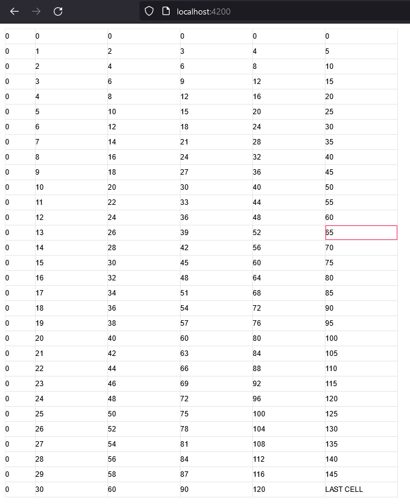

# TypeScript usage

We will show the libraries TypeScript usage by using Angular.
If you're not using Angular the approach would be pretty much the same.

Start with a new Angular app.
Install the Table Engine using `npm install table-engine` or `yarn add table-engine`.

Afterwards edit the `app.component.html` to resemble the following:

```html
<div #tableContainer class="table-container"></div>
```

This is our container the Table Engine will initialize the table canvas in.

Next edit the `app.component.ts` file:

```ts
import { AfterViewInit, Component, ViewChild, ElementRef } from '@angular/core';
import { TableEngine, CellModel, CellRange, TextCellRenderer } from 'table-engine/lib';

@Component({
  selector: 'app-root',
  templateUrl: './app.component.html',
  styleUrls: ['./app.component.scss']
})
export class AppComponent implements AfterViewInit {

  @ViewChild('tableContainer') 
  public tableContainer!: ElementRef;

  ngAfterViewInit(): void {
    const cellModel = CellModel.generate(
        [
            {
                range: CellRange.fromSingleRowColumn(30, 5),
                rendererName: TextCellRenderer.NAME,
                value: "LAST CELL"
            }
        ],
        (row, column) => row * column,
        (row, column) => TextCellRenderer.NAME,
        (row) => 25,
        (column) => column === 0 ? 50 : 120,
        new Set(),
        new Set()
    );
    
    const engine = new TableEngine(this.tableContainer.nativeElement, cellModel);
    
    engine.registerCellRenderer(new TextCellRenderer());
    
    engine.initialize();
  }

}
```

Run `ng serve`, `npm run start` or `yarn start` to start the development server.
You should see the following output in the browser at `http://localhost:4200`:


